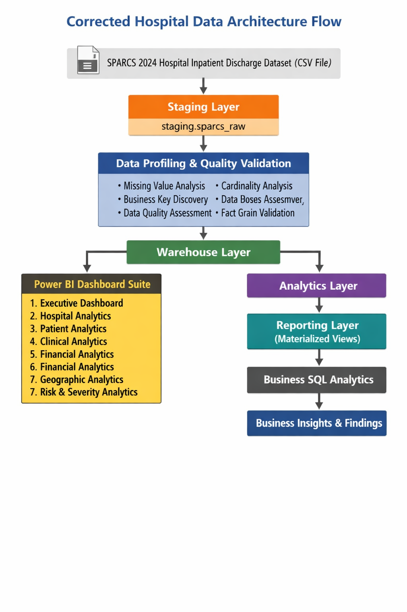
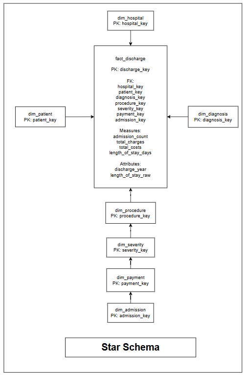
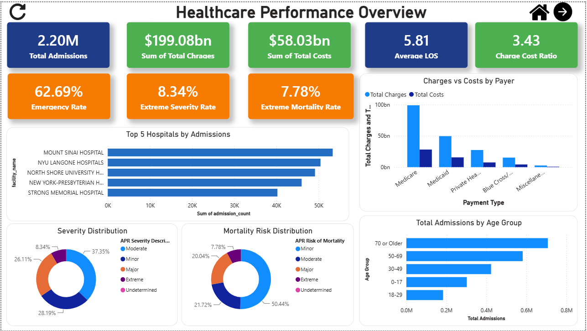
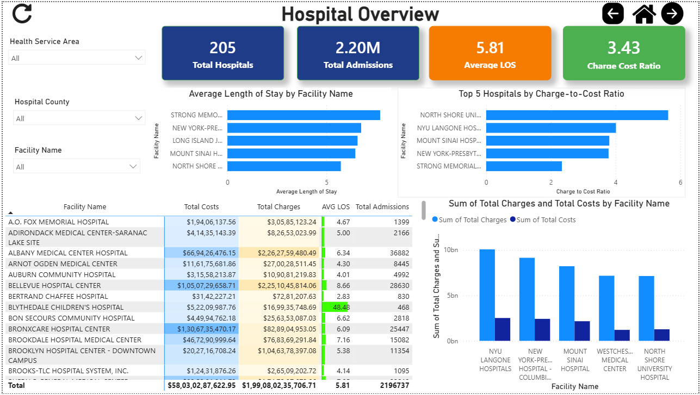
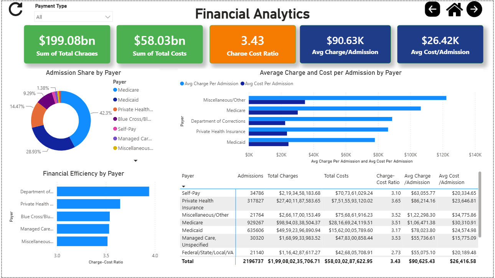

# Healthcare Analytics & Business Intelligence System

### Using New York SPARCS Hospital Inpatient Discharge Data

---

## Project Overview

Healthcare organizations generate millions of patient discharge records annually. While this data contains valuable information about hospital performance, patient demographics, clinical outcomes, healthcare costs, and regional healthcare utilization, raw healthcare datasets are difficult to analyze directly.

This project transforms over **2.1 million inpatient discharge records** from the **New York State SPARCS 2024 Hospital Inpatient Discharge Dataset** into a complete Healthcare Analytics and Business Intelligence solution using dimensional modeling, SQL analytics, performance optimization techniques, and interactive Power BI dashboards.

The project demonstrates practical skills in:

* Data Analytics
* Business Intelligence
* Data Warehousing
* Dimensional Modeling
* ETL Development
* SQL Analytics
* Performance Optimization
* Power BI Dashboard Development
* Business Insight Generation

---

## Business Problem

Healthcare decision-makers require a centralized analytical platform capable of answering business questions such as:

* Which hospitals handle the highest patient volumes?
* Which patient populations consume the most healthcare resources?
* Which diagnoses and procedures drive healthcare utilization?
* How do healthcare costs and charges vary across payer categories?
* Which geographic regions generate the highest healthcare demand?
* How does patient severity impact costs and length of stay?

Raw healthcare discharge data does not directly provide these insights.

This project addresses that challenge by building a dimensional data warehouse and business intelligence reporting solution.

---

## Dataset Information

### Source

New York State Department of Health

### Dataset

SPARCS 2024 Hospital Inpatient Discharge Data

### Dataset Availability

The original SPARCS 2024 Hospital Inpatient Discharge dataset is not included in this repository due to file size constraints.

Dataset documentation files are provided in the `data` directory.

The dataset can be obtained from the New York State Department of Health and loaded using the SQL scripts provided in this repository.

### Dataset Characteristics

| Attribute | Value                          |
| --------- | ------------------------------ |
| Records   | 2,196,737                      |
| Columns   | 33                             |
| Format    | CSV                            |
| Grain     | One inpatient discharge record |

---

## Architecture Overview

The project follows a layered data warehouse architecture that separates data ingestion, dimensional modeling, reporting, optimization, and visualization.

### Architecture Diagram



### Architecture Flow

```text
SPARCS Dataset
      │
      ▼
staging.sparcs_raw
      │
      ▼
Data Profiling & Quality Assessment
      │
      ▼
Dimensional Warehouse
      │
      ▼
fact_discharge + dimensions
      │
      ├─────────────► Power BI
      │
      ▼
Analytics Views
      │
      ▼
Materialized Views
      │
      ▼
Business SQL Analytics
      │
      ▼
Business Insights
```

---

## Star Schema Design

The warehouse follows a Star Schema architecture optimized for analytical reporting and business intelligence workloads.

### Star Schema Diagram



### Fact Table

```text
warehouse.fact_discharge
```

Fact Grain:

```text
One row = One inpatient discharge record
```

Rows:

```text
2,196,737
```

### Dimension Tables

```text
warehouse.dim_hospital
warehouse.dim_patient
warehouse.dim_diagnosis
warehouse.dim_procedure
warehouse.dim_severity
warehouse.dim_payment
warehouse.dim_admission
```

### Unknown Member Strategy

All dimensions contain an Unknown Member record:

```text
Surrogate Key = 0
```

Purpose:

* Preserve referential integrity
* Prevent fact row loss
* Handle unmatched dimension records

---

## Technology Stack

### Data Engineering

* PostgreSQL 18
* SQL
* Data Profiling
* Data Quality Assessment
* ETL Development

### Data Warehousing

* Star Schema
* Dimensional Modeling
* Fact & Dimension Design
* Surrogate Keys
* Unknown Member Strategy

### Analytics

* SQL Analytics
* Analytics Views
* Materialized Views
* Query Optimization
* Performance Benchmarking

### Business Intelligence

* Power BI
* DAX Measures
* KPI Reporting
* Interactive Dashboards
* Data Visualization

### Development & Documentation

* Git
* GitHub
* Markdown

---

## ETL Pipeline

The project implements a structured ETL process.

```text
Source Dataset
      │
      ▼
Staging Layer
      │
      ▼
Data Profiling
      │
      ▼
Dimension Loading
      │
      ▼
Fact Loading
      │
      ▼
Validation
      │
      ▼
Analytics Layer
      │
      ▼
Power BI Reporting
```

---

## Analytics & Reporting Layer

### Analytics Views

The analytics layer contains reusable reporting views.

Examples:

```text
v_executive_summary
v_hospital_performance
v_patient_demographics
v_clinical_analysis
v_financial_summary
v_geographic_analysis
v_risk_analysis
v_operations
```

### Materialized Views

Materialized views were implemented to demonstrate advanced PostgreSQL optimization techniques.

Examples:

```text
mv_hospital_performance
mv_financial_summary
mv_geographic_analysis
mv_risk_analysis
```

### Business SQL Analytics

Domain-specific analytical SQL queries were developed for:

* Hospital Analytics
* Patient Analytics
* Clinical Analytics
* Financial Analytics
* Operational Analytics
* Geographic Analytics
* Risk Analytics

---

## Power BI Data Model

Power BI connects directly to the dimensional warehouse.

### Fact Table

```text
warehouse.fact_discharge
```

### Dimensions

```text
warehouse.dim_hospital
warehouse.dim_patient
warehouse.dim_diagnosis
warehouse.dim_procedure
warehouse.dim_severity
warehouse.dim_payment
warehouse.dim_admission
```

### Not Used by Power BI

```text
analytics views
materialized views
```

Power BI directly consumes the Star Schema model for maximum flexibility and industry-standard semantic modeling.

---

## Power BI Dashboard Suite

The reporting layer contains seven interactive dashboards.

### Dashboard Pages

1. Executive Dashboard
2. Hospital Analytics
3. Patient Analytics
4. Clinical Analytics
5. Financial Analytics
6. Geographic Analytics
7. Risk & Severity Analytics

---

### Executive Dashboard



Provides an overall healthcare performance summary including admissions, costs, charges, length of stay, emergency utilization, severity, and mortality metrics.

---

### Hospital Analytics



Provides hospital-level operational and financial performance analysis including admissions, average length of stay, costs, charges, and hospital comparisons.

---

### Financial Analytics



Provides payer analysis, financial performance evaluation, charge-to-cost analysis, and healthcare spending insights.

---

## Key KPIs

The dashboard suite includes the following KPIs:

* Total Admissions
* Total Charges
* Total Costs
* Average Length of Stay
* Average Charge per Admission
* Average Cost per Admission
* Emergency Admission Rate
* Extreme Severity Rate
* Extreme Mortality Rate
* Charge-to-Cost Ratio

---

## Key Business Insights

Analysis of over 2.1 million inpatient discharge records revealed several important findings.

### Healthcare Costs & Charges

* Healthcare charges substantially exceed estimated treatment costs.
* Charge-to-cost ratios vary across hospitals and regions.
* Financial performance differs across payer categories.

### Patient Demographics

* Older age groups account for a significant portion of admissions.
* Healthcare utilization generally increases with age.
* Resource consumption differs across demographic segments.

### Hospital Performance

* Major metropolitan hospitals contribute a large share of admissions.
* Hospital efficiency varies significantly across facilities.
* High-volume hospitals generate substantial financial activity.

### Clinical Utilization

* A relatively small number of diagnoses account for a large share of admissions.
* Procedure utilization is concentrated among a limited set of procedures.
* Clinical complexity significantly impacts healthcare costs.

### Risk & Severity

* Higher severity levels are associated with longer hospital stays.
* High-risk patients consume disproportionately greater healthcare resources.
* Mortality risk and severity strongly influence healthcare costs.

Detailed findings are available in:

```text
DOCS/12_Business_Insights_Summary.md
```

---

## Skills Demonstrated

### Data Engineering

* Data Profiling
* Data Quality Assessment
* ETL Development
* Data Validation

### Data Warehousing

* Dimensional Modeling
* Star Schema Design
* Fact & Dimension Modeling
* Business Key Discovery
* Surrogate Key Design

### SQL & PostgreSQL

* Complex SQL Queries
* Analytics Views
* Materialized Views
* Query Optimization
* Performance Analysis

### Business Intelligence

* KPI Development
* Dashboard Design
* Power BI Development
* Interactive Reporting
* Data Visualization

### Analytics

* Healthcare Analytics
* Financial Analytics
* Operational Analytics
* Risk Analytics
* Business Insight Generation

---

## Repository Structure

```text
.
│   README.md
│
├── data
│
├── notebooks
│
├── DOCS
│
├── POWERBI
│
└── SQL
```

---

## Documentation

The project contains extensive technical and business documentation.

### Business Documentation

* Business Requirements Document
* KPI Definitions
* Business Insights Summary

### Technical Documentation

* Project Architecture
* Star Schema Design
* Data Dictionary
* Data Lineage
* ETL Process
* Data Model Decisions
* Technical Decisions
* Business SQL Analytics Guide

All documentation is available in the `DOCS` directory.

---

## How to Run

### PostgreSQL Setup

1. Create the database.
2. Create schemas.
3. Load the SPARCS dataset into the staging layer.
4. Execute dimension scripts.
5. Load the fact table.
6. Create analytics views.
7. Create materialized views.
8. Execute validation and optimization scripts.

### Power BI

1. Open:

```text
POWERBI/healthcare_analytics.pbix
```

2. Configure PostgreSQL connection if required.
3. Refresh the dataset.
4. Explore dashboard pages.

---

## Project Outcome

This project successfully transformed over 2.1 million healthcare discharge records into a complete business intelligence solution consisting of:

* Dimensional Data Warehouse
* SQL Analytics Layer
* Reporting Optimization Layer
* Business SQL Analytics Layer
* Interactive Power BI Dashboards
* Business Insight Documentation

The solution demonstrates practical application of data warehousing, SQL analytics, business intelligence, performance optimization, and data visualization techniques within a healthcare analytics domain.
