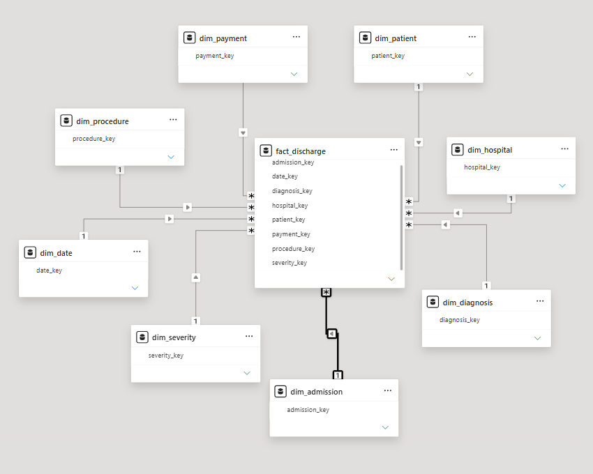

# 🏥 Healthcare Analytics & Business Intelligence System

**A production-style healthcare data warehouse and BI platform** built on PostgreSQL 18 and Power BI — transforming 7 years of NY State SPARCS inpatient discharge data (16.3M+ records) into a governed analytics warehouse and 8 executive-ready dashboards.


---

## At a Glance

| Metric | Value |
|---|---:|
| Source dataset | NYS SPARCS Inpatient Discharge Data |
| Years integrated | **7** (2011, 2012, 2014, 2018, 2021, 2023, 2024) |
| Records processed | **16,311,772** |
| Dimension tables | **8** |
| Fact tables | **1** |
| Analytics views | **11** |
| Materialized views | **6** |
| SQL analytics modules | **8** |
| Monitoring modules | **5** |
| Power BI dashboards | **8** |
| Database | PostgreSQL 18 |

---

## The Problem

Public SPARCS datasets are built for distribution, not analysis:

- Millions of rows per year, spread across inconsistent yearly files
- Transactional structure, not analytics-ready
- No centralized KPIs — business logic gets rewritten in every query
- No support for multi-year trend analysis
- No visibility into warehouse health at scale

## The Solution

A layered, production-style warehouse that standardizes ingestion, modeling, and reporting:

**Staging → Data Quality Validation → ETL → Star Schema Warehouse → Analytics & Materialized Views → Monitoring → Power BI**

Each stage is modular, so new SPARCS releases can be added without redesigning the warehouse.

---

## Architecture

```
SPARCS CSV Files
        │
        ▼
Staging Layer
        │
        ▼
Data Quality Validation
        │
        ▼
ETL Transformation
        │
        ▼
Star Schema Data Warehouse
        │
        ├──────► Analytics Views
        ├──────► Materialized Views
        └──────► Warehouse Monitoring
        │
        ▼
Power BI Dashboards
```

---

## Tech Stack

| Category | Technology |
|---|---|
| Database | PostgreSQL 18 |
| Query Language | SQL |
| DB Administration | pgAdmin 4 |
| Data Warehouse | Star Schema |
| BI Tool | Microsoft Power BI |
| Data Profiling | Python, Jupyter Notebook |
| Version Control | Git & GitHub |

---

## Dataset

**Source:** NY State Department of Health – SPARCS (Statewide Planning and Research Cooperative System)

- Publicly available, de-identified inpatient discharge data
- One record = one inpatient discharge
- Standardized schema across all 7 supported years
- 16.3M+ records loaded into the warehouse

---

## Data Warehouse Design

Built as a **Star Schema** optimized for analytical workloads.

**Fact table:** `fact_discharge` — one record per inpatient discharge

**Dimension tables:**
`dim_hospital` · `dim_patient` · `dim_diagnosis` · `dim_procedure` · `dim_severity` · `dim_payment` · `dim_admission` · `dim_date`

**Key design decisions:**
- Surrogate keys across all dimensions
- Unknown Member strategy for referential integrity
- ETL audit logging on every load
- Warehouse validation checks post-load



---

## Analytics Layer

### Analytics Views (11)
Executive Summary · Hospital Performance · Patient Demographics · Clinical Analysis · Financial Summary · Geographic Analysis · Risk Analysis · Operations · Clinical Detail · Hospital Clinical · Financial Detail

### Materialized Views (6)
Precomputed aggregations for the heaviest reporting queries — refreshed after warehouse updates to keep dashboards fast without re-scanning 16M+ rows on every load.

### Business SQL Analytics (8 modules)
Hospital · Patient · Clinical · Financial · Operational · Geographic · Risk · Trend Analytics

### Query Optimization
- Foreign key indexing
- Execution plan tuning with `EXPLAIN ANALYZE`
- Materialized views for repeated aggregations
- Warehouse statistics maintenance

---

## Warehouse Monitoring

A dedicated layer for operational visibility into warehouse health.

| Module | Purpose |
|---|---|
| Database Overview | Metadata and storage information |
| Table Statistics | Row counts and storage utilization |
| Warehouse Summary | Object summary across schemas |
| Storage Analysis | Table and index storage breakdown |
| Views & Materialized Views | Analytics asset inventory |

---

## Business Intelligence Layer

Power BI connects directly to the PostgreSQL warehouse via **Import Mode**, powering 8 interactive dashboard pages.

**Dashboard features:** interactive slicers · dynamic KPI cards · cross-filtering · bookmark navigation · year-based filtering · consistent business definitions

📥 [Full Power BI report (~450MB)](https://drive.google.com/drive/folders/1eHpAuOLM7pzCe2eLxF6XW9RRzw-QfuuR?usp=sharing) — hosted externally to keep the repo lightweight.

### Dashboard Gallery

**Executive Dashboard**


**Hospital Analytics**


**Patient Analytics**


**Clinical Analytics**


**Financial Analytics**


**Geographic Analytics**


**Risk & Severity Analytics**


**Healthcare Evolution & Trends**


---

## Repository Structure

```text
Healthcare-Analytics-BI-System/
│
├── data/                          # Dataset source & data dictionary
│
├── DOCS/                          # Technical & business documentation
│   ├── 01_TRD.md
│   ├── 02_BRD.md
│   ├── 03_Architecture_Implementation.md
│   ├── 04_Data_Dictionary.md
│   ├── 05_Data_Profiling_Quality.md
│   ├── 06_ETL_Star_Schema.md
│   ├── 07_KPI_Definitions.md
│   ├── 08_Query_Optimization.md
│   ├── 09_Dashboard_Documentation.md
│   ├── 10_Business_Insights_Report.md
│   └── images/star_schema.png
│
├── notebooks/                     # Data profiling notebook
│
├── POWERBI/
│   ├── dashboard_images/          # 8 dashboard screenshots
│   └── icons/                     # Navigation icons
│
└── SQL/
    ├── 01_database_setup/         # Database & schema creation
    ├── 02_staging/                # Raw load, ETL audit, validations
    ├── 03_dimensions/             # 8 dimension tables + unknown members
    ├── 04_fact/                   # Fact table create, load, validate
    ├── 05_views/                  # 11 analytics views
    ├── 06_analytical_queries/     # 8 business analytics modules
    ├── 07_optimization/           # Indexes & query tuning
    ├── 08_reporting_layer/        # 6 materialized views + refresh
    └── 09_monitoring/             # 5 warehouse monitoring modules
```

---

## Documentation

Full technical and business documentation lives in [`/DOCS`](DOCS/):

| Document | Description |
|---|---|
| TRD | Technical Requirements Document |
| BRD | Business Requirements Document |
| Architecture | System architecture & implementation |
| Data Dictionary | Warehouse schema reference |
| Data Profiling | Data quality & profiling results |
| ETL & Star Schema | Pipeline & dimensional model design |
| KPI Definitions | Business metric definitions |
| Query Optimization | Performance tuning approach |
| Dashboard Documentation | Power BI usage guide |
| Business Insights | Analytical findings & recommendations |

---

## Results & Achievements

- Integrated **7 years** of SPARCS healthcare data into one centralized warehouse
- Loaded **16,311,772** inpatient discharge records with full ETL audit logging
- Designed a scalable Star Schema (8 dimensions + 1 fact table)
- Built **11 analytics views** and **6 materialized views** for standardized reporting
- Implemented a **5-module warehouse monitoring layer** for operational visibility
- Delivered **8 interactive Power BI dashboards** with consistent KPIs
- Applied indexing and `EXPLAIN ANALYZE`-driven query optimization
- Produced a full suite of technical and business documentation

---

## Future Enhancements

- Automated ETL scheduling
- Incremental warehouse refresh
- Cloud deployment
- Additional SPARCS dataset years
- Forecasting & ML models on top of the warehouse
- Automated monitoring & alerting

---

## Skills Demonstrated

**Data Engineering:** ETL pipelines · data profiling · data quality validation · audit logging
**Data Warehousing:** dimensional modeling · Star Schema · surrogate keys · unknown member strategy
**PostgreSQL:** SQL development · views & materialized views · query optimization · performance tuning
**Business Intelligence:** Power BI · KPI design · dashboard design · interactive reporting
**Domain Analytics:** healthcare, financial, operational, clinical, geographic & risk analysis

---

## Connect

**GitHub:** [HemanthSai456](https://github.com/HemanthSai456)
**LinkedIn:** [Hemanth Sai Charagundla](https://www.linkedin.com/in/hemanth-sai-charagundla-4a8659376/)

If you found this project useful or have suggestions for improvement, feel free to connect or open an issue. ⭐ Stars are appreciated.
