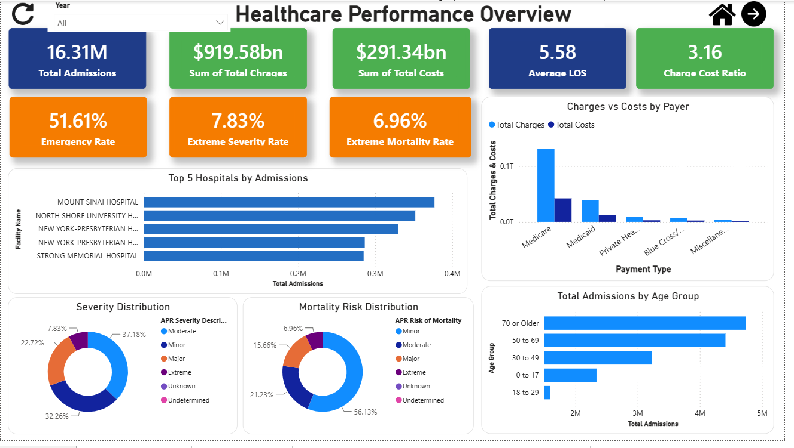
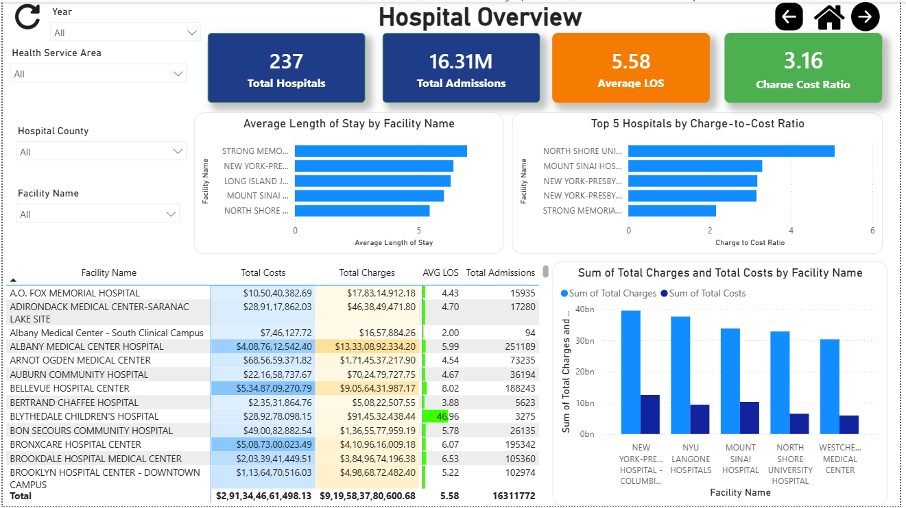
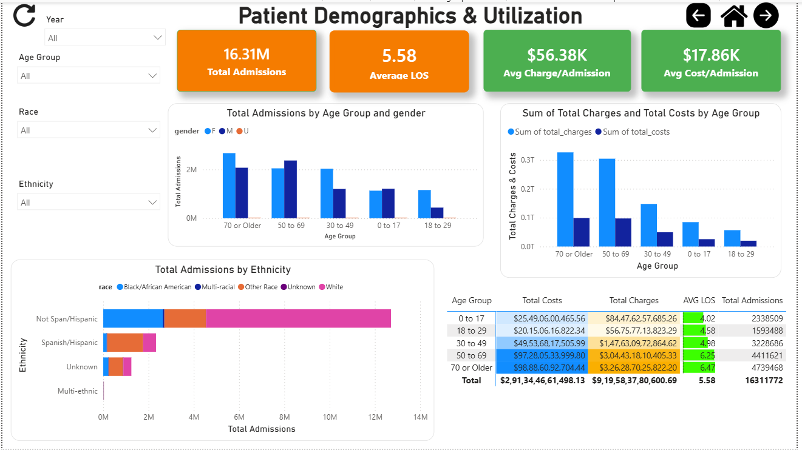
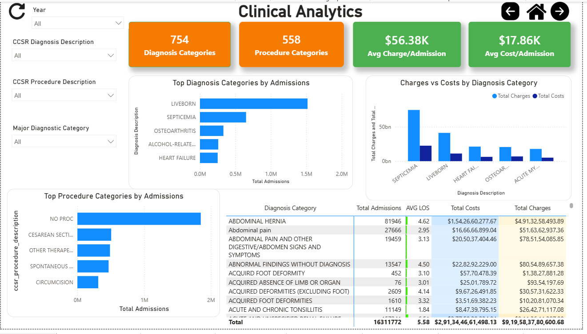
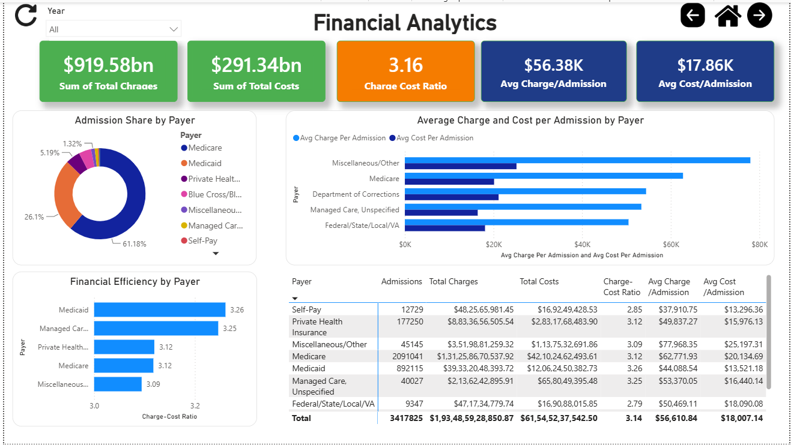
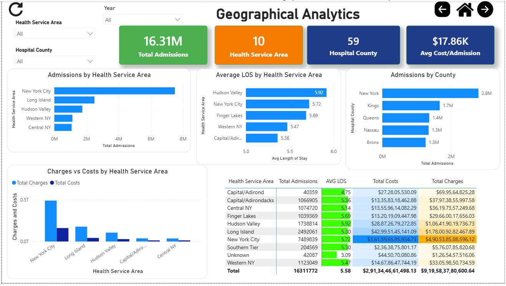
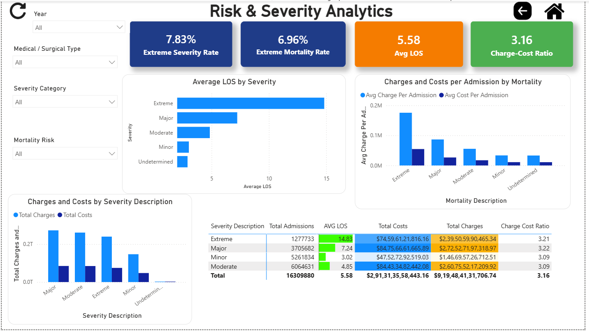
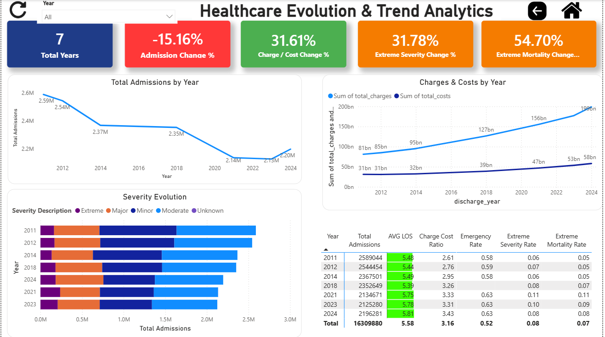

# 🏥 Healthcare Analytics & Business Intelligence System

A production-style healthcare analytics platform built with PostgreSQL 18 and Power BI, integrating 7 years of NYS SPARCS inpatient discharge data (16.3M+ records) into a governed dimensional warehouse and 8 executive-ready dashboard pages.

---

## 📊 At a Glance

| Metric | Value |
|---|---:|
| **Source dataset** | NYS SPARCS Inpatient Discharge Data |
| **Years integrated** | **7** — 2011, 2012, 2014, 2018, 2021, 2023, 2024 |
| **Records processed** | **16,311,772** |
| **Dimension tables** | **8** |
| **Fact tables** | **1** |
| **Analytics views** | **11** |
| **Materialized views** | **6** |
| **SQL analytics modules** | **8** |
| **Monitoring modules** | **5** |
| **Power BI dashboard pages** | **8** |
| **Database** | **PostgreSQL 18** |

---

## 🎯 What I Built

Public SPARCS data is distributed across yearly files and is not structured as an analytics-ready warehouse, making centralized KPI definitions and multi-year analysis difficult.

I built a layered warehouse that standardizes ingestion, modeling, and reporting end to end:

**Staging → Data Quality Validation → ETL → Star Schema Warehouse → Analytics & Materialized Views → Monitoring → Power BI**

The result answers questions across **hospital performance, patient demographics, clinical patterns, financials, geography, and risk/severity** — all from a single governed source of truth.

---

## 🏗️ Architecture

```text
SPARCS CSV Files
        │
        ▼
Staging Layer
        │
        ▼
Data Quality Validation
        │
        ▼
ETL Transformation
        │
        ▼
Star Schema Data Warehouse
   (8 Dimensions + 1 Fact)
        │
        ├──────► Analytics Views
        ├──────► Materialized Views
        └──────► Warehouse Monitoring
        │
        ▼
Power BI Dashboards
```

### 🗄️ Warehouse Model

- **Fact Table:** `fact_discharge` — one row per inpatient discharge
- **Dimension Tables:**
  - `dim_hospital`
  - `dim_patient`
  - `dim_diagnosis`
  - `dim_procedure`
  - `dim_severity`
  - `dim_payment`
  - `dim_admission`
  - `dim_date`

---

## 🛠️ Technology Stack

| Category | Technology |
|---|---|
| **Database** | PostgreSQL 18 |
| **Query Language** | SQL |
| **DB Administration** | pgAdmin 4 |
| **Data Warehouse** | Star Schema |
| **Business Intelligence** | Microsoft Power BI |
| **Data Profiling** | Python, Pandas, Jupyter |
| **Version Control** | Git & GitHub |

---

## ⭐ Engineering Highlights

### 🔧 Data Engineering

- **Multi-year SPARCS ingestion** with a dedicated staging layer
- **ETL transformation pipeline** with audit logging on every load
- **Post-load validation** and data-quality checks
- **Unknown Member strategy** for referential integrity

### 🏗️ Data Warehousing

- **Dimensional Star Schema** — 8 dimensions, 1 central fact table
- **Surrogate keys** and business-key-based dimension management
- **Standardized business definitions** across the warehouse

### 📈 Analytics & Performance

- **11 analytics views** and **8 SQL business-analytics modules**
- **6 materialized views** precomputing heavy aggregations over 16M+ rows
- **Foreign-key and analytical indexing**
- **`EXPLAIN ANALYZE`-driven query optimization**

### 🩺 Monitoring

- **Database overview** and warehouse summary
- **Table statistics** and storage analysis
- **Views / materialized-view inventory** for operational visibility

---

## 📊 Power BI

Power BI connects to the PostgreSQL warehouse via **Import Mode** and delivers 8 interactive dashboard pages with **slicers, dynamic KPI cards, cross-filtering, bookmark navigation, and consistent KPI definitions** across every page.

📥 [Full Power BI report (~450 MB)](https://drive.google.com/drive/folders/1eHpAuOLM7pzCe2eLxF6XW9RRzw-QfuuR?usp=sharing) — hosted externally to keep the repo lightweight.

---

## Dashboard Gallery

<table>
<tr>
<td width="50%"><b>Executive Dashboard</b><br></td>
<td width="50%"><b>Hospital Analytics</b><br></td>
</tr>
<tr>
<td width="50%"><b>Patient Analytics</b><br></td>
<td width="50%"><b>Clinical Analytics</b><br></td>
</tr>
<tr>
<td width="50%"><b>Financial Analytics</b><br></td>
<td width="50%"><b>Geographic Analytics</b><br></td>
</tr>
<tr>
<td width="50%"><b>Risk & Severity Analytics</b><br></td>
<td width="50%"><b>Healthcare Evolution & Trends</b><br></td>
</tr>
</table>


---

## 📌 Results

- Integrated **7 years** of SPARCS data into one centralized, queryable warehouse
- Loaded **16.3M+** inpatient discharge records with full ETL audit logging
- Reduced repeated heavy aggregation queries via **6 materialized views**
- Delivered **8 professional Power BI dashboard pages** with consistent KPI definitions
- Applied indexing and **`EXPLAIN ANALYZE`-driven tuning** across the analytics layer
- Built a **5-module monitoring layer** for ongoing warehouse operational visibility

---

## 📚 Documentation

Detailed technical and business documentation lives in [`/DOCS`](DOCS/), including:

- [Architecture & Implementation](DOCS/03_Architecture_Implementation.md)
- [ETL & Star Schema Design](DOCS/06_ETL_Star_Schema.md)
- [KPI Definitions](DOCS/07_KPI_Definitions.md)
- [Query Optimization](DOCS/08_Query_Optimization.md)
- [Business Insights Report](DOCS/10_Business_Insights_Report.md)

---

## 📁 Repository Structure

```text
Healthcare-Analytics-BI-System/
│
├── data/          # Dataset source & data dictionary
├── DOCS/          # Technical & business documentation
├── notebooks/     # Data profiling notebook
├── POWERBI/       # Dashboard screenshots & icons
└── SQL/           # Warehouse, analytics, and monitoring SQL
```

---

## 🚀 Future Enhancements

Possible directions to extend this platform further:

- Automated ETL scheduling
- Incremental warehouse refresh
- Cloud based Warehouse Deployment
- Additional SPARCS years as new data becomes available
- Forecasting and ML models on top of the warehouse
- Automated monitoring and alerting

---

## 🔗 Resources / Connect

- **Power BI Report:** [Open the full report](https://drive.google.com/drive/folders/1eHpAuOLM7pzCe2eLxF6XW9RRzw-QfuuR?usp=sharing)
- **Documentation:** [`/DOCS`](DOCS/)
- **Data Sources:** [`/data`](data/)
- **SQL Warehouse & Analytics:** [`/SQL`](SQL/)

**GitHub:** [HemanthSai456](https://github.com/HemanthSai456)  
**LinkedIn:** [Hemanth Sai Charagundla](https://www.linkedin.com/in/hemanth-sai-charagundla-4a8659376/)